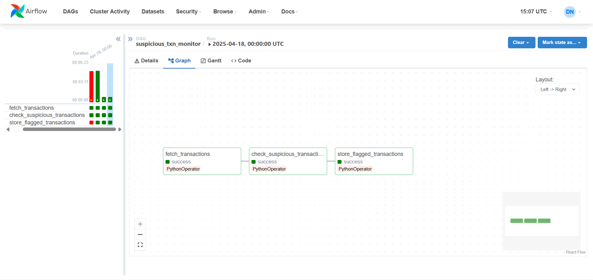

# Blockchain Transaction Monitoring System 🔍

An automated system for monitoring blockchain transactions and flagging suspicious activities using Apache Airflow and Supabase.

  

---

## 📋 Overview

This project provides a robust pipeline for monitoring blockchain transactions and automatically flagging suspicious activities based on configurable rules. It uses **Apache Airflow** for workflow orchestration and **Supabase** for data storage.

---

## ✨ Features

- **Automated Transaction Monitoring**: Daily scheduled pipeline to check for suspicious activities.
- **Configurable Detection Rules**:
  - 🚩 **Large Transaction Detection**: Flags transactions above a configurable threshold (currently >50).
  - ⚡ **Frequent Transaction Detection**: Identifies transactions occurring within suspiciously short timeframes.
- **Persistent Storage**: All flagged transactions are stored in Supabase for further analysis.
- **Containerized Architecture**: Easily deployable using Docker.

---

## 🏗️ Architecture

┌─────────────────┐     ┌─────────────────┐     ┌─────────────────┐  
│  Transaction    │     │  Suspicious     │     │                 │
│  Data Source    │──►  │  Transaction    │──►  │  Supabase       │ 
│  (Blockchain)   │     │  Detection      │     │  Storage        │
└─────────────────┘     └─────────────────┘     └─────────────────┘
        Fetch               Process                 Store

## 💻 Usage

- In the Airflow UI, enable the `suspicious_txn_monitor` DAG.
- The DAG will run daily and check for suspicious transactions.
- View flagged transactions in your Supabase database.

---

## 🧐 Detection Rules

### 🚩 Large Transaction Value
- Transactions with a value greater than **50 ETH** are flagged as suspicious.

### ⚡ Frequent Transactions
- Transactions that occur within **10 seconds** of each other are flagged as suspicious.

