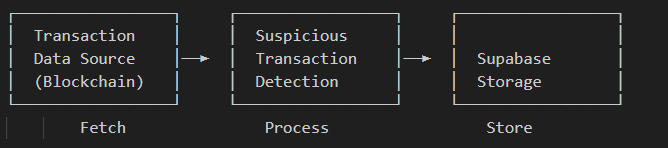

# Blockchain Transaction Monitoring System 🔍


An automated system for monitoring blockchain transactions and flagging suspicious activities using Apache Airflow and Supabase.

<p align="center">
  
</p>

---

## 📋 Overview

This project provides a robust pipeline for monitoring blockchain transactions and automatically flagging suspicious activities based on configurable rules. It uses **Apache Airflow** for workflow orchestration and **Supabase** for data storage.

---

## ✨ Features

- **Automated Transaction Monitoring**: Daily scheduled pipeline to check for suspicious activities.
- **Configurable Detection Rules**:
  - 🚩 **Large Transaction Detection**: Flags transactions above a configurable threshold (currently >50).
  - ⚡ **Frequent Transaction Detection**: Identifies transactions occurring within suspiciously short timeframes.
- **Persistent Storage**: All flagged transactions are stored in Supabase for further analysis.
- **Containerized Architecture**: Easily deployable using Docker.

---

## 🏗️ Architecture

<p align="center">
  
</p>

## 💻 Usage

- In the Airflow UI, enable the `suspicious_txn_monitor` DAG.
- The DAG will run daily and check for suspicious transactions.
- View flagged transactions in your Supabase database.

---

## 🚀 Deployment Guide

Follow these steps to deploy the Blockchain Transaction Monitoring System:

1. **Clone the Repository**:
   ```bash
   git clone https://github.com/Shawnchee/flagging-airflow.git
   cd flagging-airflow
   ```

2. **Set Up Environment Variables**:
   - Create a `.env` file in the root directory.
   - Add the required environment variables for Supabase and Airflow.

3. **Build and Start Docker Containers**:
   ```bash
   docker-compose up --build
   ```

4. **Access the Airflow UI**:
   - Open your browser and navigate to `http://localhost:8080`.
   - Log in using the default credentials (configured in the `docker-compose.yml` file).

5. **Enable the DAG**:
   - In the Airflow UI, enable the `suspicious_txn_monitor` DAG to start monitoring transactions.

6. **Monitor Logs**:
   - Use the Airflow UI or `docker logs` to monitor the pipeline's execution.

---

## 🧐 Detection Rules

### 🚩 Flagging Service Providers
- Service providers holding funds in their wallets for **more than 30 days** are flagged as suspicious.

### ⚡ Suspicious Document Uploads
- Charities that upload **malformed or suspicious documents** during registration are flagged for review.


